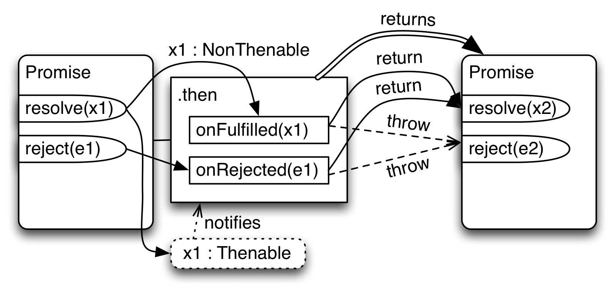

# 02-promise

Promise: Lời hứa diễn ra trong tương lai

1 lời hứa sẽ có 3 trạng thái :  pending , onfulfilled, on rejected.

Khi một Promise đã chuyển sang trạng thái $\text{Fulfilled}$ hoặc $\text{Rejected}$, nó được gọi là $\text{Settled}$ (Đã giải quyết) và trạng thái đó sẽ không bao giờ thay đổi nữa.

-Lời hứa đáng tin : lần tới anh khảo bài em sẽ học hành đầy đủ , nếu không học thì em nghỉ luôn, nếu có học bài mong anh xóa sẹo cho em.

---
__pending:__ là giai đoạn chờ xử lý cho đến khi có [kết quả] , tính từ bây giờ đến lần khảo bài tiếp theo .

//giai đoạn hoàn thành sẽ có 2 trạng thái:

__on fulfilled__ : đã có kết quả và lời hứa này (thành công) - resolve("anh xóa sẹo")

__on rejected__ : đã có kết quả (thất bại) - reject("nghỉ học")

Lưu ý :  __resolve__ là điều mình mong muốn chứ ko chắc chắn là điều anh (server) làm .

Không có promise nào vừa on fulfilled , vừa on rejected đc nha!!!

--- 
## Cú pháp khai báo Promise:

```javascript
new Promise(function (resolve, reject){});
new Promise( (resolve, reject)=>{});
```
__Lưu ý:__
Promise nhận vào 1 callback function , trong callback function sẽ gọi đến resolve và reject chứ promise không phải nhận vào resolve và reject nha .

---
## Mô tả một lời hứa dưới dạng code
__Lời hứa__ : Anh người yêu hứa với cô gái rằng "cuối tháng này anh sẽ mang 5000 về cho em , nếu không thì em cứ gọi anh là "jack con" nhưng nếu được anh mong 1 món quà.


```javascript
let wallet = prompt("Nhập tiền vào ví: "); //sếp 
//  tác nhân thứ 3 tác động đến lời hứa


//anh người yêu hứa - lời hứa được khởi tạo 
let p1 = new Promise((resolve, reject) => {
    if(wallet >= 5000) resolve("1 món quà");
    else reject("jack con");
});

//-----------------------------------------------
// cô gái kiểm chứng 
// hứa thì phải có người kiếm chứng
// bản chất kiểm chứng là đi xử lý then và catch

p1.then((value) => {
    console.log("tui cho bạn " + value);
}).catch((error)=>{
    console.log("You are "+ error);
});

```

- __then( tương đương với resolve )__, value là những gì có trong resolve
- __catch( tương đương với reject )__, error là những gì có trong reject
---
## Mô phỏng server hoạt động: hiểu rõ vai trò của promise
---
Trước khi vô phần này cần tìm hiểu về khái niệm kiện hàng response.

Tìm hiểu response(kiện hàng) từ server

1.server chỉ reject khi mất mạng, server luôn resolve mọi thứ kể cả yêu cầu vô lý , nó sẽ trả ra status (400-500) kèm câu chửi gì đó chứ không từ chối.

2.nếu em đủ điều kiện nhận data

        resolve({
            status: 2xx,
            data: dữ liệu
        })

3.nếu em không đủ điều kiện nhận data

        resolve({
            status: 4xx,
            message: câu chửi
        })
---

Frontend và Backeend giao tiếp với nhau  bằng lời hứa (promise)

- __Frontend__ : yêu cầu backend cung cấp dữ liệu (fetchAPI ,AXios => tìm hiểu ở bài sau)
- __Backend__ : tiếp nhận yêu cầu và __hứa__ tui sẽ xử lý cho anh ngay. => lời hứa được đặt ra

---
```javascript

// backend hứa sẽ đưa dữ liệu cho frontend
// thực tế thì fe phải req thì be mới hứa  nha
let p2 = new Promise((resolve, reject) => {
    setTimeout(()=>{
        resolve({
            status : 200, //oke
            data : {fname : "Điệp" , age:"30"},
        })
    },2000); 
});


// frontend : kiểm chứng lười hứa 
// hay frontend xử lý then catch

p2.then((response)=>{
    if (response.status >= 200 && response.status < 300) {
    console.log("Đã có dữ liệu rồi nè");
    console.log(response.data);
    } else if (response.status >= 400 && response.status <= 500) {
    console.log(response.message);
    }
}
).catch((error)=>{
    console.log("Server cúp điện");
});

```
---
Tính chất quan trọng phải hiểu :

__Promises are eager not lazy__

Giải thích :
- __Eager__ : Promise đã thực thi ngay từ khi bạn khởi tạo lệnh __new Promise(executor)__, mã bên trong executor (chứa các logic bất đồng bộ) bắt đầu thực thi ngay lập tức mà không cần bạn gọi then hay catch.
- __Lazy__ : Promise không chờ đợi cho đến khi được gọi bằng hàm then mới bắt đầu công việc đâu nha.

```javascript
let a = 1;

let p3 = new Promise((resolve, reject) => {
    a++;//2
});

//Output
console.log(a); 
// Người chưa học kĩ sẽ nghĩ Output = 1 

// Nhưng đó là sai lầm vì Promise hoạt động/ được tính từ khi gọi lệnh new Promise rồi chứ ko phải chờ gọi ra thì nó mới chạy đâu nha

// Output = 2 mới đúng nha bà !!!
```
Do tính chất của Promise là eager và lazy nên nếu hệ thống có 10000000 request thì cũn có tương ứng 10000000 promise xử lý then, catch được tạo ra nhằm xửu lý request.

Mà khi tạo ra quá nhiều promise như vậy, server sẽ luôn luôn chạy liên tục 100000 promise mà khi người dùng chỉ yêu cầu 1 request , tức dùng tận 100000 promise để xử lý 1 request ==> nó bị phí và tạo gánh nặng cho server á...< Chắc máy phải buffalo lắm mới chạy được cỡ đó í hhha >

Nên giờ mình sẽ học cách xử lý theo để khắc phục điểm yếu này nha :

Như những gì trước đó đã học thì chỉ có 1 thứ có quy tắc sẽ chạy khi ta gọi, đó là hàm nên mình sẽ áp dụng nó để xử lý tránh tạo nhiều Promise chạy cùng lúc ,khi nào cần sẽ gọi gián tiếp thông qua hàm và  hàm sẽ gọi trực tiếp Promise đó thực thi .

---
### cách 1: 
```javascript
//vận dụng đoạnc ode phia trên nha
function handle(){
    return new Promise((resolve, reject) => {
        a++;
    });
}
handle();
```
---
### cách 2:
```javascript
// dùng arrow function
let p3 = () => {
    new Promise((resolve, reject) => {
        a++;
    });
}
console.log(a);
```
---
# 💡 Tóm Tắt Trạng Thái Promise
Một promise thì sẽ chỉ có thể rơi vào 1 trong 3 trạng thái sau: 

---

|Status | **pending**  | on fulfilled  | on rejected |
|     :---:    |     :---:    |   :---:       |    :---:     |
|             value |              | `resolve`| `reject` |
|            acion  |              | `.then`   | `.catch`  |
---
    resolve trả giá trị cho then
    reject trả giá trị cho catch
---

__resolve và reject giống return nhưng không chia luồng và ko dừng lại__
ví dụ 1 : 
```javascript
//sẽ có một số người code ghép resolve và reject chung như này

let p4 = new Promise((resolve, reject)=> {
    resolve("ahihi");
    reject("Lỗi nè");
    console.log("Xin chào");
});

//kiểm chứng
p4.then((value)=>{
    console.log("Giá trị nè "+ value);
}).catch((error)=>{
    console.log( "Lỗi nè : " + error);
});
```
Lúc này nó sẽ đi tới luồng mới ở then hay catch ???

=> Khi nó thực thi , nó gặp lệnh resolve đầu tiên nên nó đã vô then rồi và khi nó vô then nó lập tức gán trạng thái promise là __onfulfilled__ , đồng nghĩa nó sẽ phớt lờ reject đi vì nó có trạng thái rồi.

---
### Return và throw trong then và catch:

Để nó chỉ chắc chắn vô then thì nên code như này :
```javascript
let p4 = new Promise((resolve, reject)=> {
    return resolve("ahihi"); //có thể làm ngược lại với reject
    reject("Lỗi nè");
    console.log("Xin chào");
});

//kiểm chứng
p4.then((value)=>{
    console.log("Giá trị nè "+ value);
}).catch((error)=>{
    console.log( "Lỗi nè : " + error);
});
``` 
---


---
### ví dụ về then return, throw

```javascript
let p4 = new Promise((resolve, reject)=> {
    return resolve("ahihi");
    reject("Lỗi nè");
    console.log("Xin chào");
});
//kiểm chứng
p4.then((value)=>{
    console.log("Giá trị nè "+ value);
})
    .catch((error)=>{
        console.log( "Lỗi nè : " + error);
        throw "Lê Hồ Điệp";// return Promise.resolve("Lê Hồ Điệp")
    })
    .then((value)=>{
    console.log();
    })
    .catch();

```
---
__Quan trọng__: 

- __return trong then | catch__ sẽ đưa Promise về on filfulled

- __throw trong then | catch__ sẽ đưa Promise về on rejected

---
## Mô phỏng xử lý luồng => ứng dụng return throw nè

- frontend : yêu cầu server cung cấp data của profile(3s) và article(2s)
- backend : tiếp nhận yêu cầu , tạo lời hứa.
---
```javascript
//khởi tạo lời hứa
let getProfile = () =>
    new Promise((resolve, reject) => {
        setTimeout(() => {
        resolve({ fname: "Điệp", age: 30 });
        }, 3000);
    });

let getArticle = () =>
    new Promise((resolve, reject) => {
        setTimeout(() => {
        resolve(["Báo chí", "Tiểu thuyết"]);
        }, 2000);
    });

```
frontend kiểm chứng:

```javascript
//Trường hợp 1 : độc lập khi nó ko dính níu gì tới nhau

getProfile().then((value) => {
    console.log(value);
});

getArticle().then((value) => {
    console.log(value);
});

```
---
```javascript
//Trường hợp 2 : hệ quả , 2 req có quan hệ nguyên nhân kết quả: 

// 2.1 lồng promise vô bên trong nhưng cách này gây ra promise hell
getProfile().then((value) => {
    console.log(value);
    getArticle().then((value) => { 
        console.log(value);
    });
});
//nếu >10 promise sẽ gây promise hell


// 2.2 : dùng return và throw 
// => nên làm theo cách này dùng return để qua nhiều tầng nha :

getProfile()
    .then((value) => {
        console.log(value);
        return getArticle();
    })
    .then((value) => {
        console.log(value);
    });

```


---
Mô tả đường đi của code khi then catch mà dùng return và throw

